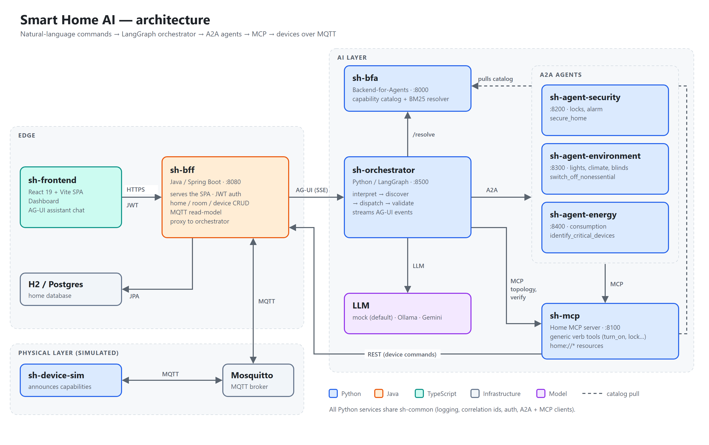

# Arquitetura

Visão consolidada do sistema. Para o histórico de fases, ver o
[`ARCHITECTURE.md`](../ARCHITECTURE.md); para os requisitos e decisões de
design, ver [`spec/`](../spec/).

<picture>
  <source media="(prefers-color-scheme: dark)" srcset="./architecture-dark.png">
  
</picture>

> Fonte do diagrama: [`architecture.html`](architecture.html) (SVG; o comando
> para regerar os PNGs com o Chrome headless está no comentário do topo).

## Fluxo de ponta a ponta

```
Navegador (SPA sh-frontend, servida pelo BFF)
   │  POST /auth/login · GET /api/home-status (SSE) · POST /api/agui/run (SSE)
   ▼
BFF (Java/Spring) ── JWT, banco H2/Postgres, read-model MQTT
   │  /api/agui/run repassado em streaming
   ▼
Orchestrator (LangGraph + LangChain)
   │  descoberta de agentes/MCP por capability
   ▼
BFA (catálogo puxado de CATALOG_SOURCES, ranking BM25 por capability)
   │
   ├──▶ Security / Environment / Energy (A2A, JSON-RPC via a2a-sdk)
   │        │
   │        └──▶ Home MCP (streamable-http via SDK oficial `mcp`)
   │
   └──▶ Home MCP (chamado também diretamente pelo Orchestrator: topologia e conferência do efeito)

Home MCP ──REST──▶ BFF ──MQTT──▶ Mosquitto ◀──MQTT── device-sim
```

O Dashboard lê o estado dos dispositivos direto do BFF (`/api/home-status`,
alimentado por MQTT), sem passar pela IA. Só o chat do assistente chega ao
Orchestrator, e sempre via BFF, para o navegador ver uma única origem.

O Orchestrator nunca fala com Security/Environment/Energy/Home MCP por
endereço fixo: descobre cada um via BFA (`POST /resolve/agents` ou
`POST /resolve/tools`) a cada execução do grafo. O BFA devolve o **nome
lógico** do serviço (`http://{service}`), montado a partir do catálogo que
ele mesmo puxou de `CATALOG_SOURCES` — nenhum serviço autodeclara nem
registra sua própria URL.

O Home MCP não guarda estado: é um adaptador fino sobre o BFF. Comandos
viram chamadas REST ao BFF, que publica no MQTT; o `device-sim` reage,
devolve o novo `.../state` e anuncia o descritor de capabilities de cada
dispositivo, que o BFF persiste.

## Serviços e portas

| Serviço      | Porta | Protocolo de entrada           | Papel                                                        |
|--------------|-------|--------------------------------|--------------------------------------------------------------|
| bff          | 8080  | HTTP (SPA + `/api/**`, JWT)    | Borda única: serve a SPA, autentica, persiste a casa, MQTT, proxy do assistente |
| bfa          | 8000  | REST (FastAPI)                 | Catálogo de capabilities (pull) + `/resolve` BM25             |
| home-mcp     | 8100  | MCP (streamable-http)          | Tools de verbo genéricas + resources `home://*` sobre o BFF   |
| security     | 8200  | A2A (JSON-RPC)                 | Trancar porta, armar alarme, `secure_home`                    |
| environment  | 8300  | A2A (JSON-RPC)                 | Luzes, temperatura, cortinas, `check_environment`             |
| energy       | 8400  | A2A (JSON-RPC)                 | Consumo, `identify_critical_devices`                          |
| orchestrator | 8500  | REST + AG-UI (SSE)             | Interpreta linguagem natural, orquestra os agentes            |
| device-sim   | —     | MQTT                           | Dispositivos simulados; anuncia capabilities                  |
| mosquitto    | 1883  | MQTT                           | Broker entre BFF e dispositivos                               |
| ollama       | 11434 | HTTP                           | LLM local (`LLM_PROVIDER=ollama`; o padrão é `mock`)          |

## Por que cada protocolo usa o SDK oficial

O projeto existe para demonstrar essas tecnologias de verdade, não uma
aproximação simplificada — por isso cada protocolo nomeado usa o pacote
oficial em vez de uma implementação própria:

- **MCP** — pacote `mcp` (`MCPServer`, transporte `streamable-http`).
  Tools/resources/prompts são registrados com os decorators reais do SDK
  (`@mcp.tool()`, `@mcp.resource()`, `@mcp.prompt()`), e o Home MCP expõe
  `home://*` como resources de verdade, não endpoints REST disfarçados.
- **A2A (Agent2Agent)** — pacote `a2a-sdk`. Cada agente expõe um **Agent
  Card** real em `/.well-known/agent-card.json` (o path fixo definido pela
  especificação A2A) e um endpoint JSON-RPC. As URLs de interface do
  Agent Card são relativas por design (nunca autodeclaradas) e resolvidas
  pelo cliente contra o `endpoint` que o BFA forneceu — mantendo o mesmo
  princípio de "ninguém autodeclara seu próprio endereço" usado no BFA.
  O ciclo de vida da Task segue o protocolo real (`TaskUpdater`,
  `TaskState.TASK_STATE_SUBMITTED` antes de qualquer atualização de
  status).
- **AG-UI** — `ag-ui-protocol` no backend (Python) e `@ag-ui/client` no
  frontend (TypeScript). A execução real do LangGraph
  (`graph.astream(..., stream_mode="updates")`) é traduzida em eventos
  AG-UI de verdade (`RunStarted`, `StepStarted/Finished`,
  `ToolCallStart/End/Result`, `TextMessageStart/Content/End`,
  `RunFinished/Error`) — o frontend consome via `HttpAgent`, não via um
  esquema de eventos simplificado.

## Catálogo do BFA (catalog-first, spec/13)

Não há mais auto-registro nem heartbeat. O BFA é **estado derivado**: no
boot (e em `POST /refresh`) ele **puxa** o descritor de cada URL listada em
`CATALOG_SOURCES` — `/.well-known/agent-card.json` para agentes A2A,
`/tools` para o MCP — e reconstrói o índice BM25. O catálogo pode ser
recriado do zero a qualquer momento; uma fonte fora do ar no boot é
re-tentada, não é fatal. `/resolve*` devolve **nomes lógicos de serviço**
(`http://{service}`), nunca `IP:porta` — a plataforma escolhe a instância.
Isso é o que permite que a suíte E2E (ver [`testing.md`](testing.md))
derrube e suba o BFA no meio dos testes: ao voltar, ele re-puxa o catálogo
sozinho.

## LangGraph do Orchestrator

```
START → interpret ─┬─▶ chitchat → END
                   └─▶ discover → plan → dispatch → collect → validate → (recovery_explain | final)
```

Há dois branches condicionais. Depois de `interpret`, conversa fiada
(saudações etc.) vai direto para `chitchat` e termina, sem acionar agentes.
Em `validate`, o grafo confere o efeito da mutação
contra o que o Home MCP de fato retornou (nunca confia na alegação do
LLM/agente). Qualquer falha — comando não reconhecido, capability sem
agente saudável, efeito não confirmado — cai em `recovery_explain`, que
gera uma resposta explicando o que não funcionou, em vez de expor uma
exceção crua ao usuário.
